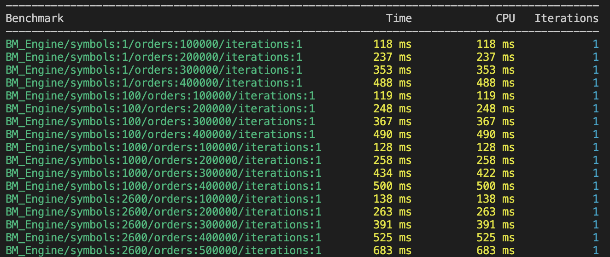

# quantaTrader
**quantaTrader** is a highly optimized, low-latency order matching system designed for high-frequency trading (HFT) applications. Written in C++, it is capable of handling millions of orders per second with very low latency.


## Latency
The primary focus of quantaTrader is low latency. High-frequency trading typically requires microsecond (10^-6 seconds) to sub-microsecond latency per operation to maintain competitiveness in the market. The engine achieves this by employing various optimization techniques.

Current benchmarking on an M2 MacBook Pro shows an average per operation latency of **1.5 microseconds**.

## CPU and Memory Optimization

1. **Memory Alignment and Cache Optimization**: data structures are aligned in memory with CPU word boundaries that are in powers of 2. This alignment enhances CPU cache efficiency by reducing the number of cache lines needed to access frequently used data, minimizing cache misses, and improving overall performance.

2. **Minimal Dynamic Memory Allocation**: direct management of objects in containers reduces the overhead associated with frequent dynamic memory operations (like new or delete). Thus reducing overall memory fragmentation and overhead.

3. **Asynchronous I/O and Event Handling**: when orders are added, modified, or executed, the corresponding I/O event is handled asynchronously. This ensures the main processing thread is not stalled by I/O operations, thereby reducing waiting times.

4. **Robin Hood Hashing**: [Robin Hood](https://github.com/martinus/robin-hood-hashing) hashing is used in in large hash maps to minimize variance in probe lengths, thus ensuring a more uniform distribution of entries. This leads to a much better lookup performance and cache efficiency.

5. **Use of Structured Bindings (auto [a, b])**: this feature from C++17 allows efficient unpacking of tuples returned from functions like emplace(). This minimizes the overhead associated with copying or accessing elements separately.

6. **Minimized Copy Operations with std::piecewise_construct**: reduces the number of copies required for constructing elements in maps. This avoids unnecessary copying and enhances performance by directly constructing the elements in place.

## System Structure
There are 4 primary components in this system:
1. **Order**: Represents an individual trading order, with various attributes like price, quantity and symbol (stock symbol like AAPL for Apple). Supports order types like market orders, limit orders, stop orders, and trailing stop orders, each with specialized handling functions.
2. **Level**: Represents a collection of orders at a specific price level within the order book. It manages all orders that share the same price and order side, sorted by their entry time (FIFO ordering).
3. **Order Book**: Each symbol has its own order book that manages all buy and sell levels for that symbol. This has all the complicated logic related to adding, matching, executing, deleting orders.
4. **Engine**: The central component that orchestrates interactions between various order books and manages global trading operations. Has a separate order book for each symbol: 1000 symbols in the trading engine means 1000 order books.

Sample Hierarchy:
```
Engine
│
├── OrderBook (Symbol: SMPL)
│   ├── BUY Levels
│   │   ├── Level (Price: 150.00)
│   │   │   ├── Order
│   │   │   └── Order
│   │   └── Level (Price: 148.00)
│   │       ├── Order
│   │       └── Order
│   │
│   └── SELL Levels
│       ├── Level (Price: 151.00)
│       │   ├── Order
│       │   └── Order
│       └── Level (Price: 153.00)
│           └── Order
│
├── OrderBook (Symbol: EXMP)
│   ├── BUY Levels
│   │   └── Level (Price: 248.00)
│   │       └── Order
│   │
│   └── SELL Levels
│       └── Level (Price: 252.00)
│           ├── Order
│           └── Order

```
*Note: for simplicity, details and fields have been truncated. Information in the diagram is not complete*

## Get Started ## 

### Prerequisites
- C++17 or higher
- CMake
- [Boost Libraries](https://www.boost.org/)
- [Google Benchmark](https://github.com/google/benchmark)

### Installation
1. Clone the repository
    ```
    git clone https://github.com/agoel25/quantaTrader.git
    cd quantaTrader
    ```
2. Build the Project: The script will create a build directory, run CMake to configure the project, and compile the source files. You will also be able to see the benchmark results if you have google benchmark installed.
    ```
    ./build.sh
    ```
3. Test with Sample Executable: Use the sample executable to test basic functionality
    ```
    ./build/engine_sample
    ```

### Benchmarking Results
*Legend*: Last entry gives the result of adding/matching 500,000 orders for 2600 symbols


### References
1. High Frequency Trading Explained: [article](https://builtin.com/articles/high-frequency-trading#:~:text=The%20components%20of%20an%20HFT%20system%20include%20the%20database%2C%20scrapper,order%20executer%2C%20and%20quantitative%20analysis.)
2. Building a Trading System: [article](https://web.archive.org/web/20110219163418/http://howtohft.wordpress.com/2011/02/15/building-a-trading-system-general-considerations/)
3. How to Build a Fast Limit Order Book: [article](https://web.archive.org/web/20110219163448/http://howtohft.wordpress.com/2011/02/15/how-to-build-a-fast-limit-order-book/)
4. The Basics of Trading Stocks: [article](https://www.investopedia.com/investing/basics-trading-stock-know-your-orders/)
5. Matching Orders: [article](https://www.investopedia.com/terms/m/matchingorders.asp)
6. jmsadair's RapidTrader: [repo](https://github.com/jmsadair/RapidTrader)
7. chronoxor's CppTrader: [repo](https://github.com/chronoxor/CppTrader)
8. How fast if your order book implementation: [forum](https://www.elitetrader.com/et/threads/how-fast-is-your-limit-order-book-implementation.255567/)
9. Coding Jesus' Trading Engine Server: [youtube](https://youtu.be/BUG7Mv-sPIY?feature=shared)
